# ANDROID APP

## Description:
This Android application serves as a comprehensive client for a video-sharing social media platform inspired by YouTube.

## Features:
1. **User Authentication:** Register new users and log into existing accounts securely.
   
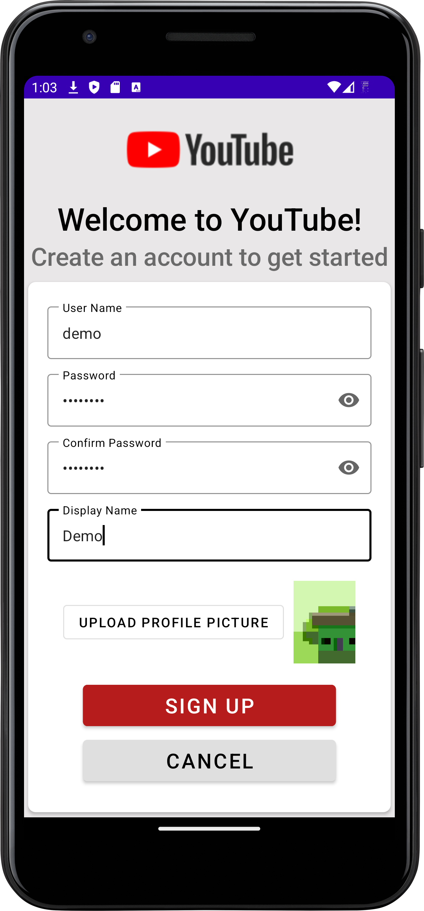 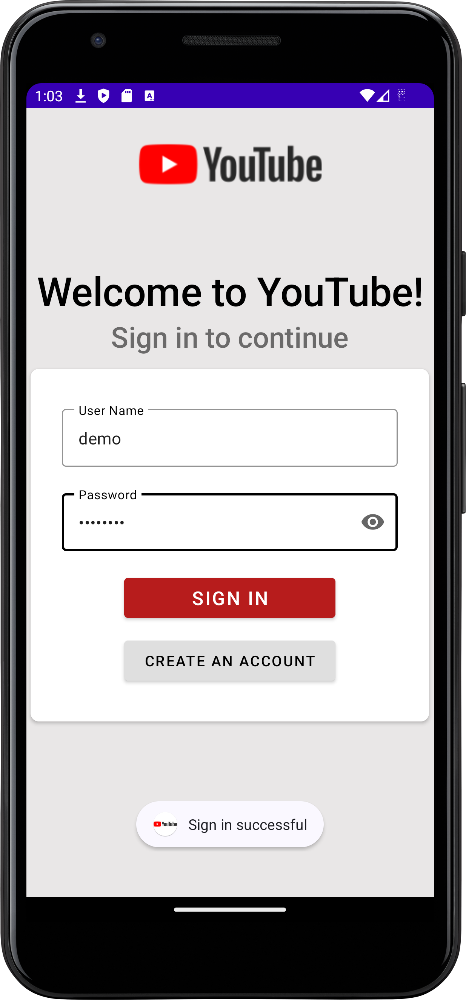

2. **Video Feed Display:** Show the most viewed videos and random videos.

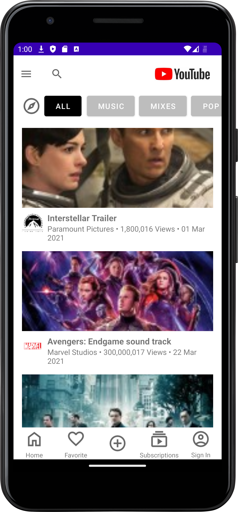 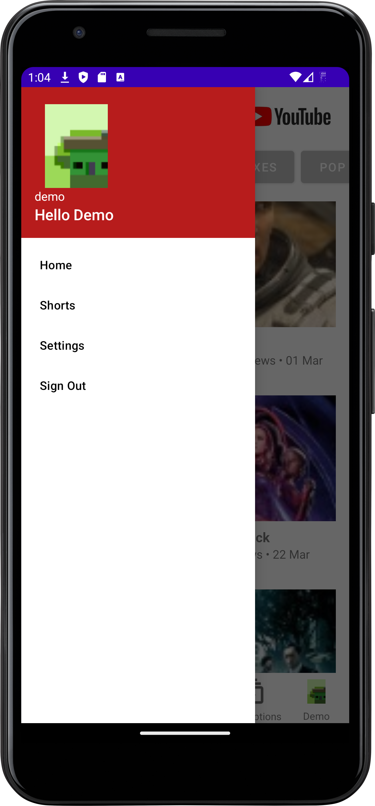

3. **Video Management:** Upload, edit, and delete videos.

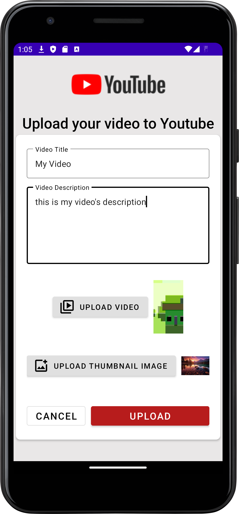 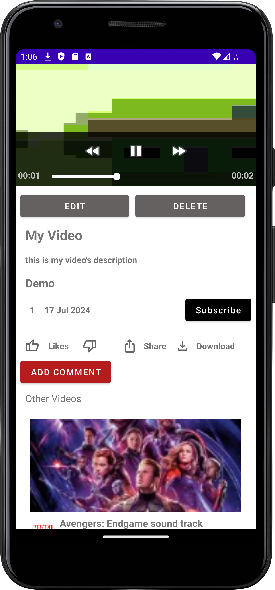

4. **Comment Management:** View, add, edit, and delete comments on videos.

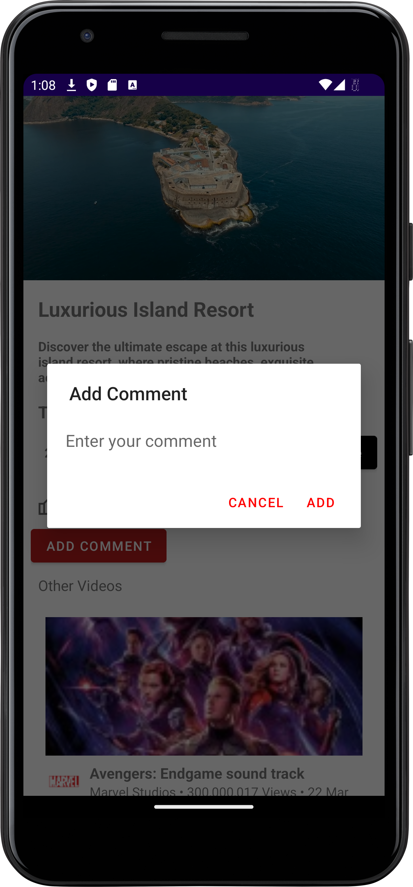 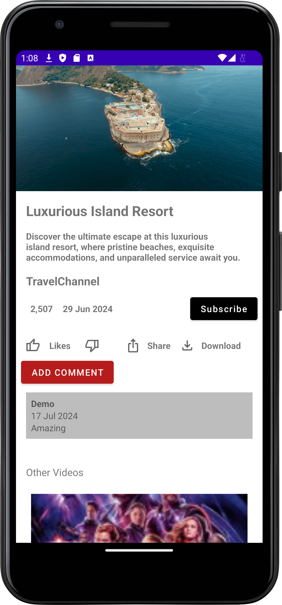 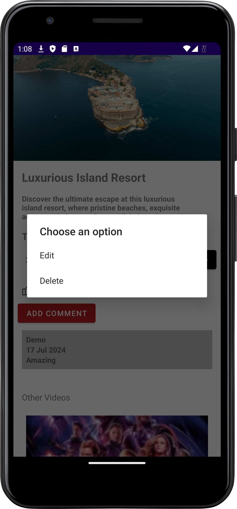
   
5. **User Profile Management:** View and update user profiles, including profile picture and display name.

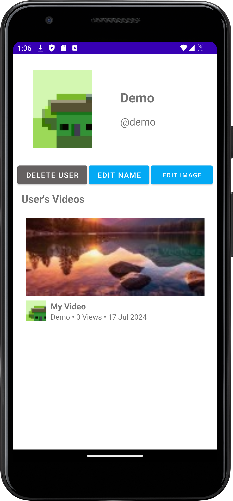

6. **Search Functionality:** Search for videos by video name.

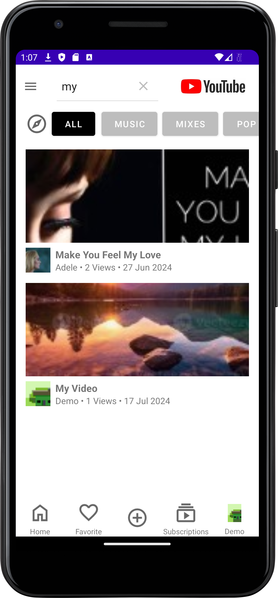

7. **Dark/Light Mode:** Supports dark and light themes which are automatically set by device's preferences, for an optimal user experience in different lighting conditions.

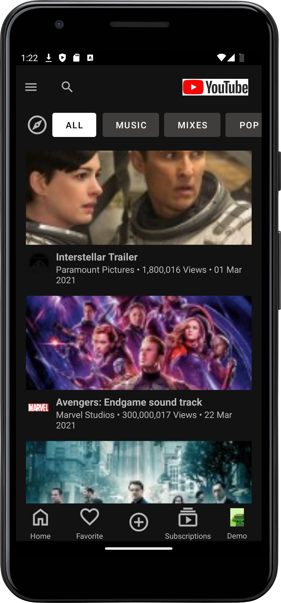 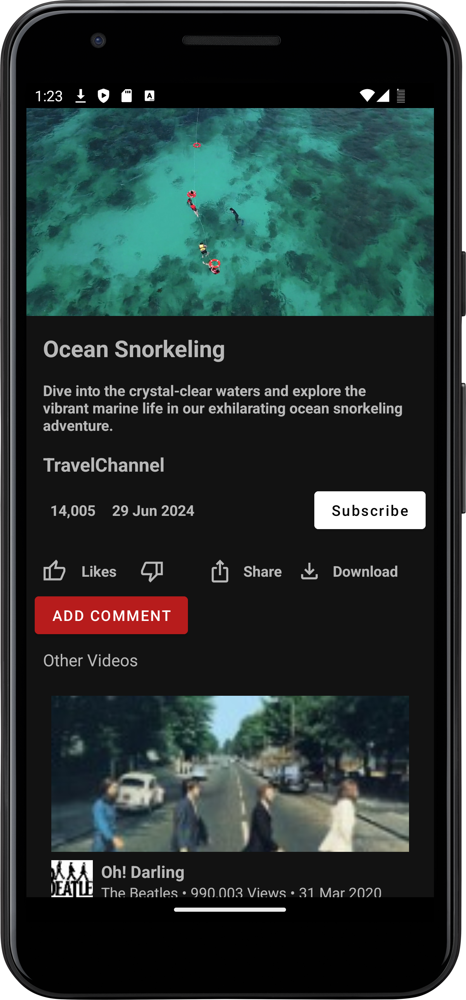 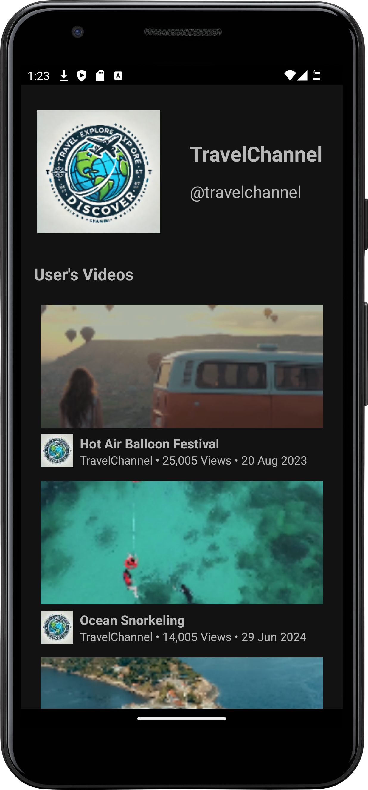

## App Flow

**Sign In or Create Account**

* Click on the "Sign In" Button in the right bottom corner of the home screen, it will navigate you to the sign-in page.
* Alternatively, you can sign in by clicking "sign in" on the side menu in home screen.
  On the sign-in page, you can either enter your existing account or create a new account.

* For your convenience, we created a demo account you can use.
* Its sign in details are:
    - Username: admin
    - Password: admin123

**Sign Out (Side Menu)**
* Open the left menu in home screen:
  Click on the menu button, and click the "Sign Out" button to log out of the application.

**User Page**
* All users pages with the user's details and videos uploaded by him can be reached by clicking on the user's name on a video screen (below the video itself).
* Signed in user can access his own user page by clicking the user's icon in the bottom right corner in home screen.

**Home Screen**
* On home screen you can see 20 videos, 10 of them are the most viewed videos and another 10 are selected randomly.
* Searching specific videos can be done in home screen by using the search bar.
* To get back to the default videos after a search was done, clear the search box and click "X".

## User Permissions

**Upload, Edit, and Delete Videos**
* Only signed-in users can upload, edit, or delete its own videos.
* Uploading a video can be done by clicking the "+" icon in the bottom of the home screen.
* Options to edit and delete videos you have uploaded will become available in the video details page.

**Comments on Videos**
* Only signed-in users can comment on videos, edit their comments, or delete their comments.
* After signing in, you can add comments to videos by clicking "add comment".
* You can delete and edit your own comments by clicking on them.

**Update and delete users**
* To update or delete an account, the user must be logged in and access his own page. He can choose to edit his profile picture or display name, or delete his account.
* Deleting a user will also delete all of the videos uploaded by him, the comments on these videos and the comments published by him on other videos.
