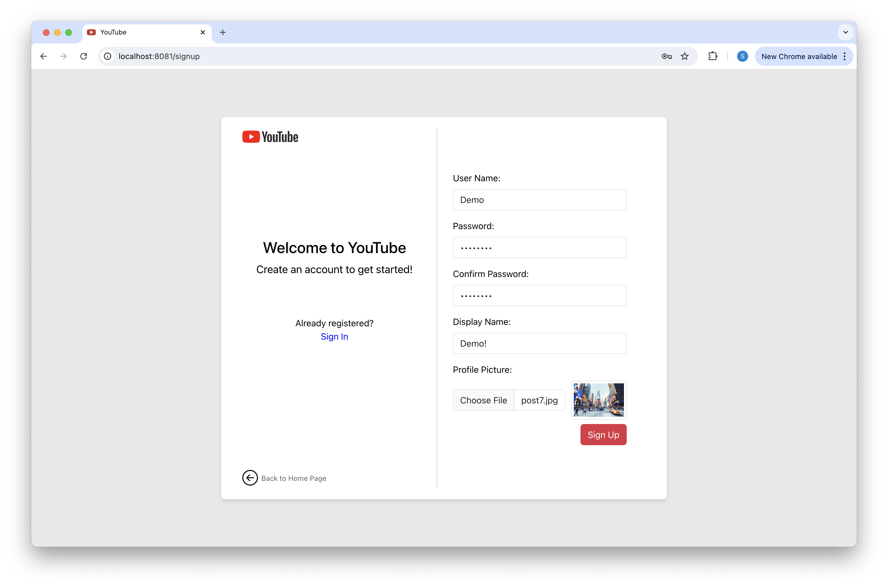
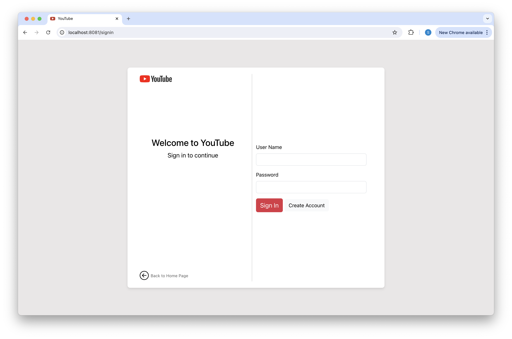
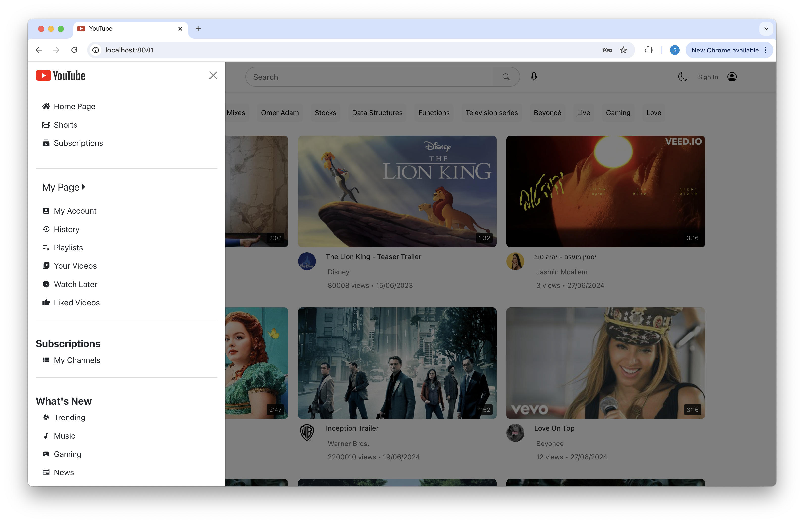
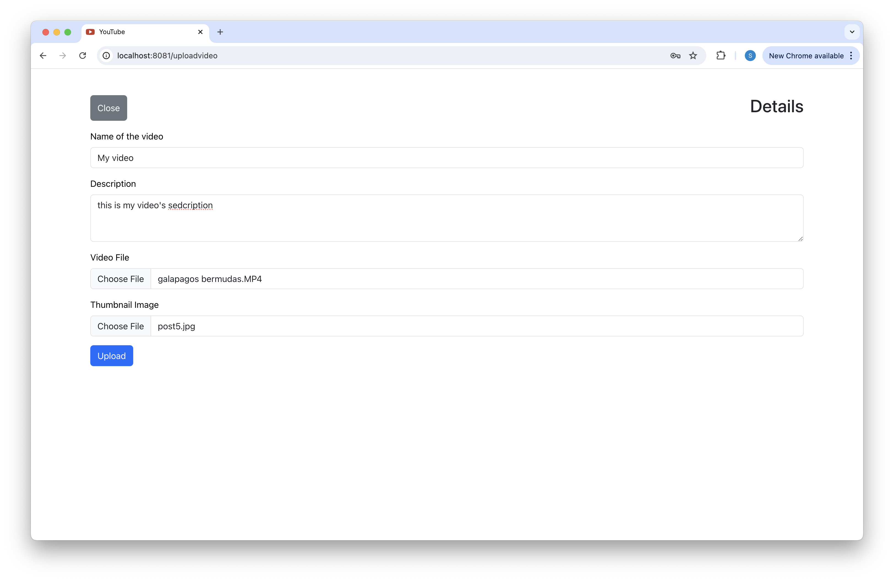
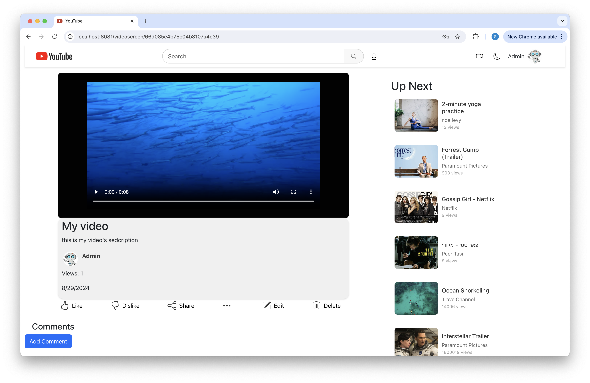
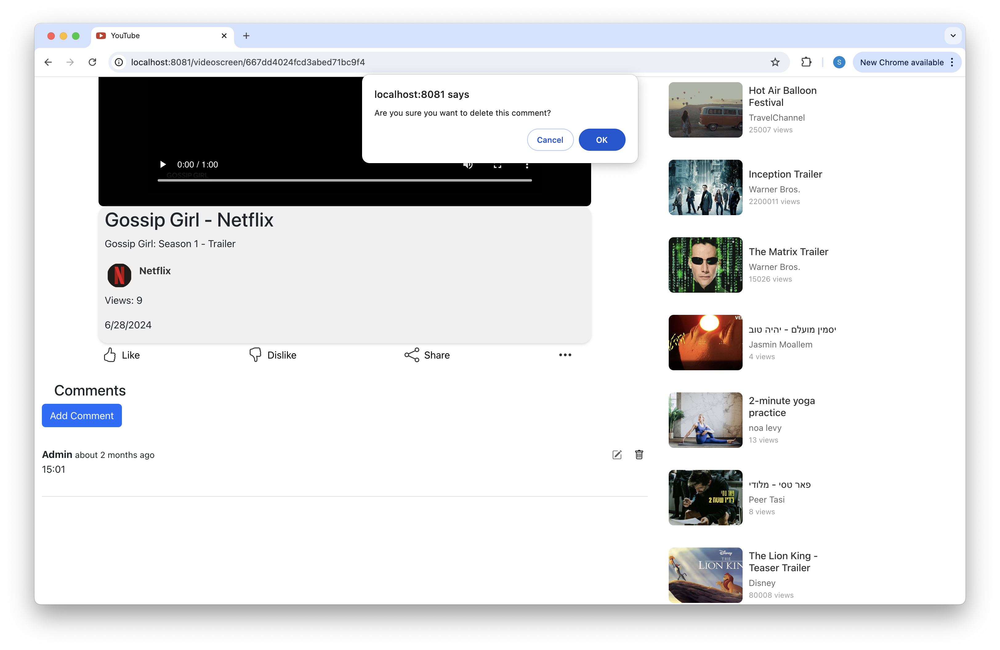
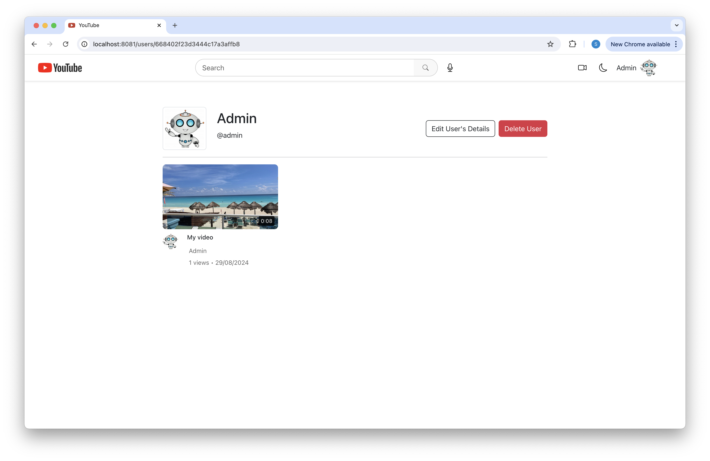
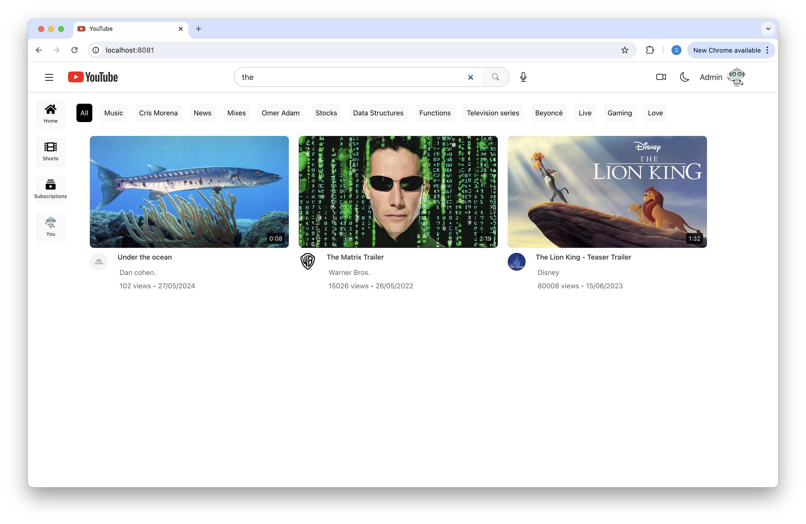
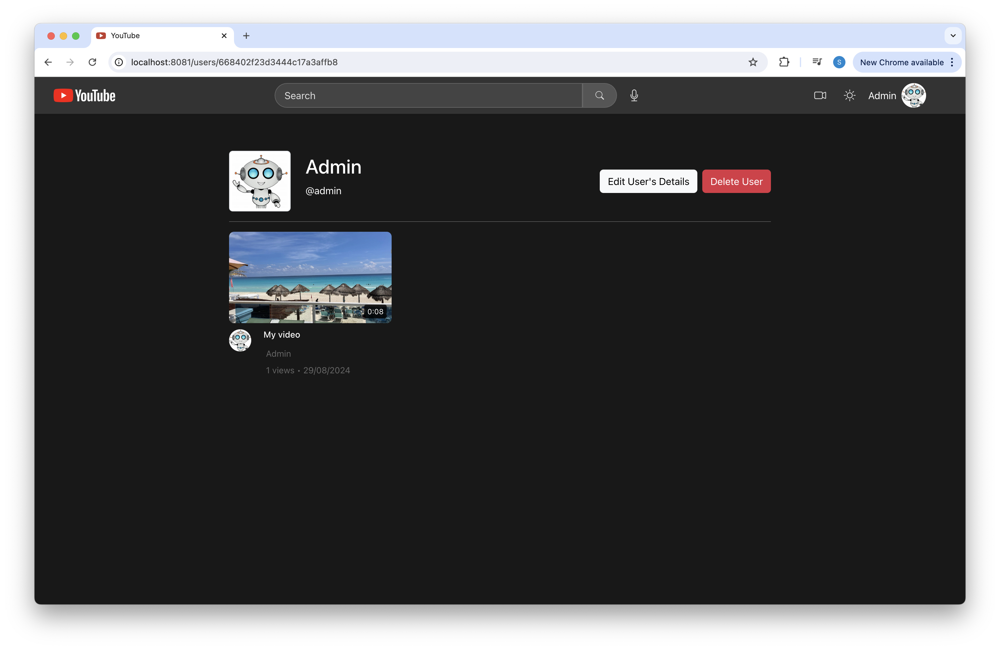
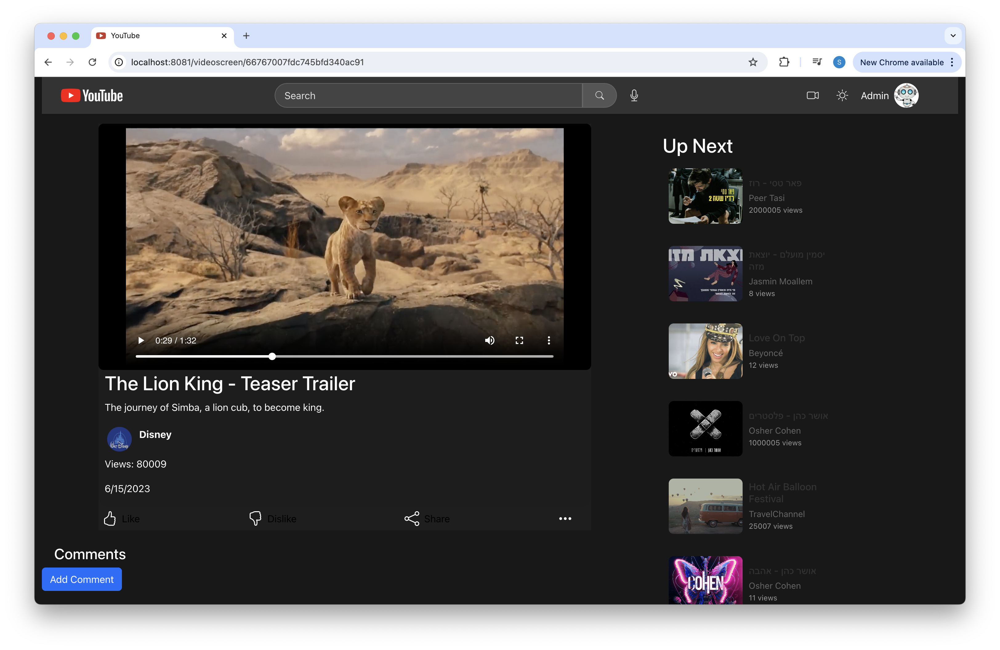

# YouTube Web App

## Description:
This web application serves as the front-end interface for a video-sharing social media platform inspired by YouTube. It allows users to watch, upload, and manage videos, as well as interact with other users through comments and profile management.

## Features:
1. **User Authentication:** Securely register new users and log into existing accounts.

 

2. **Video Feed Display:** Browse the most viewed and randomly selected videos on the home page.

 

3. **Video Management:** Upload, edit, and delete videos.

 

4. **Comment Management:** View, add, edit, and delete comments on videos.

 

5. **User Profile Management:** View and update user profiles, including profile picture and display name.

6. **Search Functionality:** Search for videos by video name.

7. **Dark/Light Mode:** Supports dark and light themes which are automatically set by device's preferences, for an optimal user experience in different lighting conditions.

  

## App Flow
