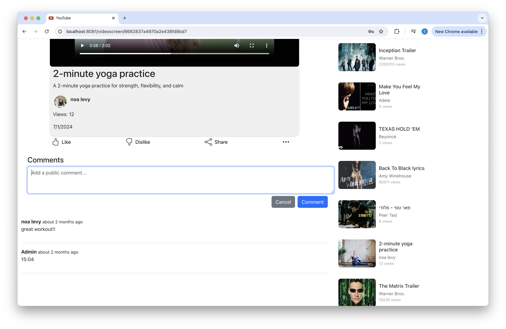

# YouTube Web App

## Description:
This web application serves as the front-end interface for a video-sharing social media platform inspired by YouTube. It allows users to watch, upload, and manage videos, as well as interact with other users through comments and profile management.

## Features:
1. **User Authentication:** Securely register new users and log into existing accounts.

 

2. **Video Feed Display:** Browse the most viewed and randomly selected videos on the home page.

 

3. **Video Management:** Upload, edit, and delete videos.

 

4. **Comment Management:** View, add, edit, and delete comments on videos.

 

5. **User Profile Management:** View and update user profiles, including profile picture and display name.

6. **Search Functionality:** Search for videos by video name.

7. **Dark/Light Mode:** Supports dark and light themes which are automatically set by device's preferences, for an optimal user experience in different lighting conditions.

  

## App Flow

**Sign In or Create Account (Top Right Corner)**

* Click on the "Sign In" Button, it will navigate you to the sign-in page.
  On the sign-in page, you can either enter your existing account or create a new account.

* For your convenience, we created a demo account you can use.
* Its sign in details are:
    - Username: admin
    - Password: admin123

**Sign Out (Left Menu)**
* Open the left menu in home page:
  Click on the menu button, and click the "Sign Out" button to log out of the application.

**User Page**
* All users pages with the user's details and videos uploaded by him can be reached by clicking on the user's icon on a video screen (below the video itself).
* Signed in user can access his own user page by clicking the user's icon in the top right corner, or by clicking the "You" button on the left menu in home page.

**Home Screen**
* On home screen you can see 20 videos, 10 of them are the most viewed videos and another 10 are selected randomly.
* Searching specific videos can be done only in home screen by using the search bar.

## User Permissions

**Upload, Edit, and Delete Videos**
* Only signed-in users can upload, edit, or delete videos.
* After signing in, you will see a "video camera" button near the search bar, which allows you to upload new videos.
* Similarly, options to edit and delete videos you have uploaded will become available in the video details page.

**Comments on Videos**
* Only signed-in users can comment on videos, edit their comments, or delete their comments.
* After signing in, you can add comments to videos by typing in the comment box and submitting.
* You will also see options to edit or delete comments on videos.

**Update and delete users**
* To update or delete an account, the user must be logged in and access his own page. He can do so by clicking the "edit" or "delete" buttons on the right side of the page.
* The user can edit his display name and his profile picture.
* Deleting a user will also delete all of the videos uploaded by him, the comments on these videos and the comments published by him on other videos.